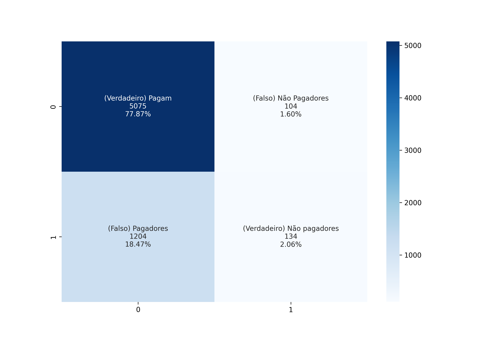

# Previsão de risco de Crédito

Pré-processamento realizado em: https://github.com/leandric/DataScience/tree/main/01-An%C3%A1lise%20Explorat%C3%B3ria/Pr%C3%A9-Processamento

#
Bibliotecas utilizadas:

```
import pickle
from sklearn.naive_bayes import GaussianNB
from sklearn.metrics import accuracy_score, confusion_matrix, classification_report
import seaborn as sns
import numpy as np	
```

* A base teste contém 6.517 registros, sendo 5.179(89%) de clientes que pagam o empréstimo e de 1.338(17%) que não pagam o empréstimo.
* Algoritmo consegue identificar corretamente 98% dos clientes que pagam empréstimo com uma precisão de 81%
* Algoritmo consegue identificar corretamente 10% dos clientes que não pagam empréstimo com uma precisão de 56%

**O algoritmo tem um bom desempenho em identificar bons pagadores**

|				| precision 	| recall		| f1-score	| support 	|
|---------------	|-------		|-----------	|-----------	|-------		|
| Pagadores		| 0.81		| 0.98		| 0.89	    	| 5179		|
| Não Pagadores	| 0.56		| 0.10 		| 0.17    	| 1338		|	
|accuracy		|      		|        	| 0.80  		| 6517		|
|macro avg 		| 0.69 		| 0.54		| 0.53 		| 6517		|
|weighted avg 	| 0.76		| 0.80 		| 0.74  		| 6517		|


#### Confusion Matrix



