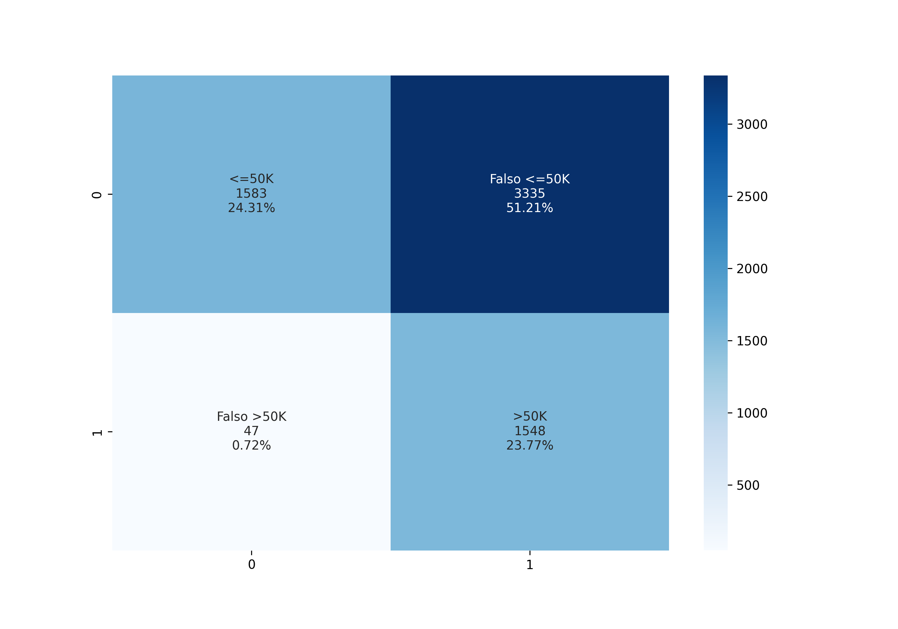

# Previsão de renda

Pré-processamento realizado em: https://github.com/leandric/DataScience/tree/main/01-An%C3%A1lise%20Explorat%C3%B3ria/Pr%C3%A9-Processamento

#
Bibliotecas utilizadas:

```
import pickle
from sklearn.naive_bayes import GaussianNB
from sklearn.metrics import accuracy_score, confusion_matrix, classification_report
import seaborn as sns
import numpy as np
import matplotlib.pyplot as plt	
```

* A base teste contém 6.513 registros, sendo 4.918(75%) dos individuos com renda <=50k e de 1.595(25%) >50k.
* Algoritmo consegue identificar corretamente 32% dos individuos com renda de <=50k com uma precisão de 97%
* Algoritmo consegue identificar corretamente 97% dos individuos com renda de >50k com uma precisão de 32%

**O modelo se motra improdutivo para esse conjunto de dados...**

|				| precision 	| recall		| f1-score	| support 	|
|---------------	|-------		|-----------	|-----------	|-------		|
| <=50k		| 0.97		| 0.32		| 0.48	    	| 4918		|
| >50k	| 0.32		| 0.97 		| 0.48    	| 1595		|	
|accuracy		|      		|        	| 0.48  		| 6513		|
|macro avg 		| 0.64 		| 0.65		| 0.48 		| 6513		|
|weighted avg 	| 0.81		| 0.48 		| 0.48  		| 6513		|


#### Confusion Matrix


