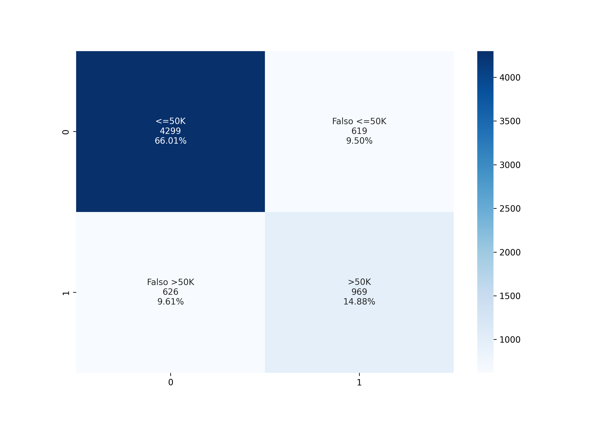

# Previsão de renda

Pré-processamento realizado em: https://github.com/leandric/DataScience/tree/main/01-An%C3%A1lise%20Explorat%C3%B3ria/Pr%C3%A9-Processamento

#
Bibliotecas utilizadas:

```
import pickle
from sklearn.tree import DecisionTreeClassifier
from sklearn.metrics import accuracy_score, confusion_matrix, classification_report
from sklearn import tree
import seaborn as sns
import matplotlib.pyplot as plt
import numpy as np
```

* A base teste contém 6.513 registros, sendo 4.918(75%) dos individuos com renda <=50k e de 1.595(25%) >50k.
* Algoritmo consegue identificar corretamente 87% dos individuos com renda de <=50k com uma precisão de 87%
* Algoritmo consegue identificar corretamente 61% dos individuos com renda de >50k com uma precisão de 61%

**O modelo possue melhor performance para identificar individuos com renda menor ou igual a 50 mil ano.**

|				| precision 	| recall		| f1-score	| support 	|
|---------------	|-------		|-----------	|-----------	|-------		|
| <=50k		| 0.87		| 0.87		| 0.87	    	        | 4918		|
| >50k	| 0.61		| 0.61 		| 0.61    	                | 1595		   |	
|accuracy		|      		|        	| 0.81  		    | 6513		|
|macro avg 		| 0.74 		| 0.74		| 0.74		        | 6513		|
|weighted avg 	| 0.81		| 0.81 		| 0.81 		        | 6513		|


#### Confusion Matrix
