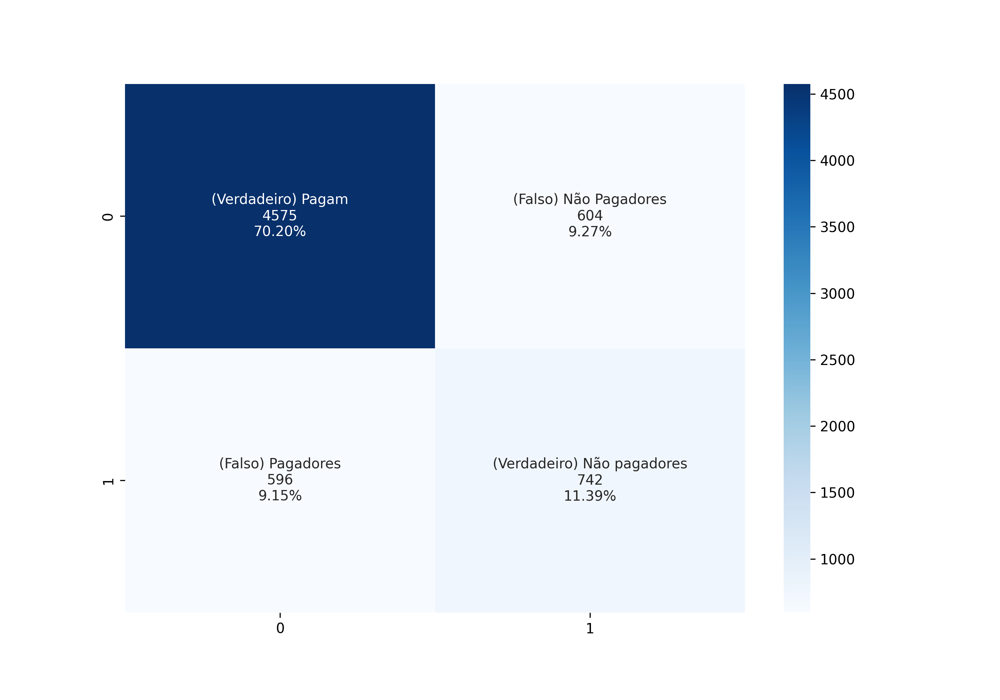

# Previsão de Risco de Crédito

Pré-processamento realizado em: https://github.com/leandric/DataScience/tree/main/01-An%C3%A1lise%20Explorat%C3%B3ria/Pr%C3%A9-Processamento

#
Bibliotecas utilizadas:

```
import pickle
from sklearn.tree import DecisionTreeClassifier
from sklearn.metrics import accuracy_score, confusion_matrix, classification_report
from sklearn import tree
import seaborn as sns
import matplotlib.pyplot as plt
import numpy as np
```

* A base teste contém 6.517 registros, sendo 5.179(79%) de clientes que pagam o empréstimo e de 1.338(21%) que não pagam o empréstimo.
* Algoritmo consegue identificar corretamente 88% dos clientes que pagam empréstimo com uma precisão de 88%
* Algoritmo consegue identificar corretamente 55% dos clientes que não pagam empréstimo com uma precisão de 55%

**O algoritmo tem um bom desempenho em identificar bons pagadores.**

|				| precision 	| recall		| f1-score	| support 	|
|---------------	|-------		|-----------	|-----------	|-------		|
| Pagadores		| 0.88		| 0.88		| 0.89	    	| 5179		|
| Não Pagadores	| 0.55		| 0.55 		| 0.55    	| 1338		|	
|accuracy		|      		|        	| 0.82  		| 6517		|
|macro avg 		| 0.72 		| 0.72		| 0.72 		| 6517		|
|weighted avg 	| 0.82		| 0.82 		| 0.82  		| 6517		|


#### Confusion Matrix

